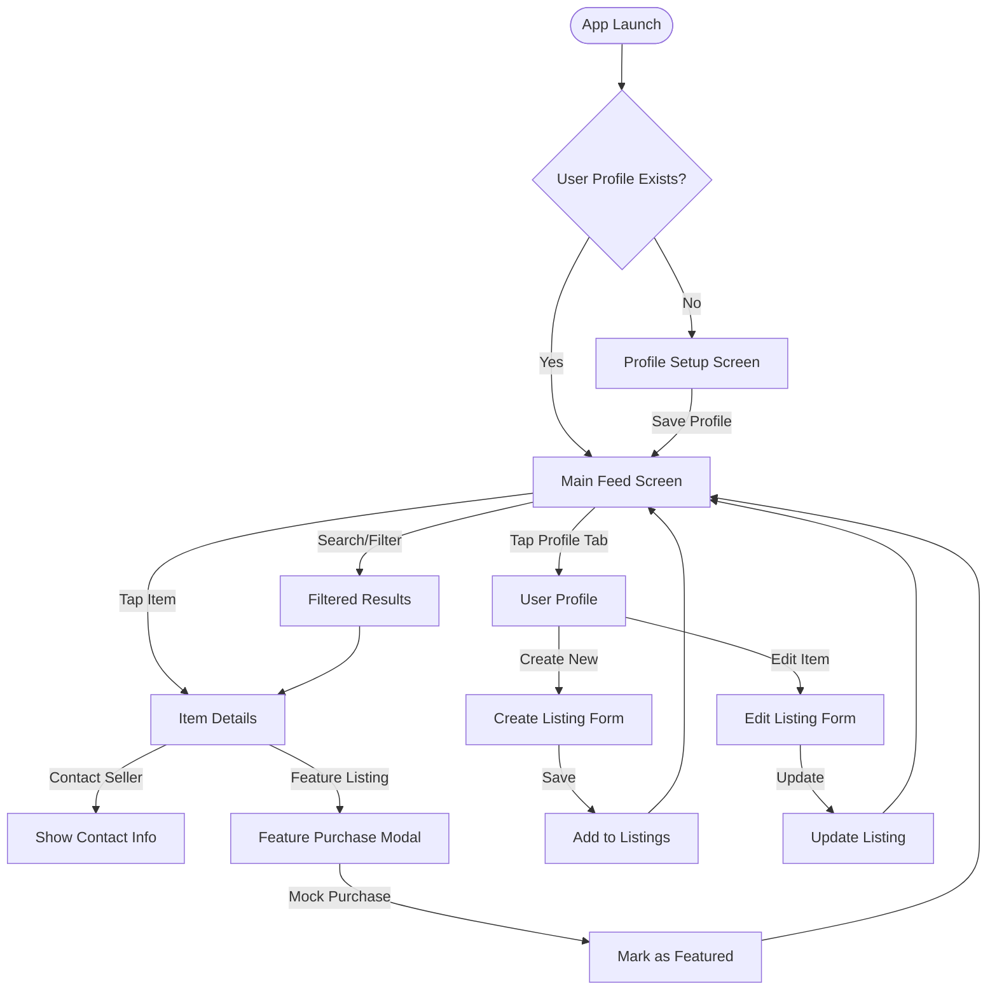
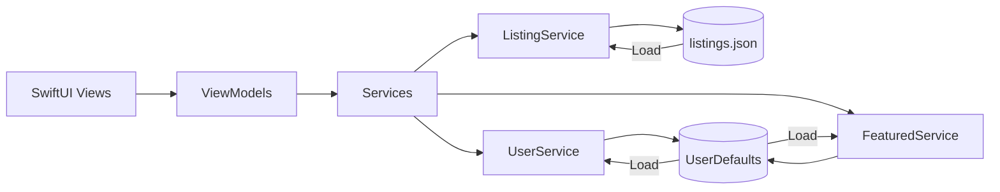

---
Name: CampusSwap - Student Marketplace App

Overview: Complete implementation plan for CampusSwap, a hyper-local student marketplace app for buying, selling, and trading textbooks, furniture, and notes. Includes business case, technical architecture, and step-by-step implementation guide.

**Project Status**: Foundation Complete - Profile Setup Screen Implemented.

**Current Phase**: Core Development.

**Deadline**: February 2nd, 2026, 9:00 AM

# CampusSwap - iOS Group Project Development Plan

## Project Timeline & Deadlines

- **Deadline**: February 2nd, 9:00 AM (projects retrieved, no commits after)
- **Team Size**: 4 members
- **Git Repository**: Must be created and invitation sent before January 25th, 11:59 PM

## Team Collaboration Strategy

### Git Workflow

- **Main Branch**: `main` (protected, only merges via PR)
- **Feature Branches**: Each member works on separate feature branches
  - `feature/feed-screen`
  - `feature/item-details`
  - `feature/profile-screen`
  - `feature/data-services`
  - `feature/premium-features`
- **Naming Convention**: `feature/[brief-description]` or `fix/[issue-description]`
- **Commit Messages**: Clear, descriptive (e.g., "Add FeedView with list/grid toggle")
- **Pull Requests**: Required before merging to main, at least one team member review

### Task Division (4 Team Members)

**Bilal - Data Layer & Services**:

- Models (`Listing`, `UserProfile`, `ItemCategory`)
- `ListingService` (CRUD operations)
- `UserService` and `FeaturedService`
- Data persistence (JSON file handling)
- **Deliverable**: Complete data layer that other members can use

**Aakash - Main Feed Screen**:

- `FeedView` implementation
- `FeedViewModel`
- `ListingRowView` and `ListingGridView` components
- Search and filter functionality
- Featured items sorting logic
- **Deliverable**: Fully functional feed screen

**Mouhamad - Item Details & Profile Screens**:

- `ProfileSetupView` (first-time user onboarding)
- `ItemDetailView` and `ItemDetailViewModel`
- `ProfileView` and `ProfileViewModel`
- `CreateListingView` and `EditListingView`
- Contact seller functionality
- **Deliverable**: Complete profile setup, item details and profile screens

**Helijao - Premium Features & UI Polish**:

- `FeatureListingView` (premium purchase modal)
- Featured badge component
- Ad banner component
- UI polish, styling, animations
- Error handling and empty states
- **Deliverable**: Premium features and polished UI

### Parallel Work Strategy

**Sprint 1 (First 5 Days - Jan 19-23)**:

- All members: Review plan, architecture, project structure
- Bilal: Complete data models and services
- Aakash, Mouhamad, Helijao: Initialize views, basic layouts

**Sprint 2 (Next 5 Days - Jan 26-30)**:

- Bilal: Sample data, integration support
- Aakash: Feed screen functionality and UI
- Mouhamad: Details & Profile screen functionality and UI
- Helijao: Premium features, components, UI polish

**Final Weekend (Jan 31-Feb 1)**:

- All members: Integration, bug fixes, testing
- All: Prepare presentation
- **Deadline**: Feb 2nd 9:00 AM (Submission)

### Communication & Coordination

- **Daily Standups**: Quick sync on progress and blockers
- **Shared Documentation**: Keep `README.md` and `BUSINESS_CASE.md` updated
- **Code Reviews**: Review each other's PRs before merging
- **Merge Conflicts**: Resolve together, don't force push to main

## Phase 1: Business Case & Feature Definition COMPLETED

### 1.1 Business Case Documentation 

**App Name**: CampusSwap

**Problem Statement**:

- Students spend too much money on new textbooks and course materials
- Selling used items is difficult due to shipping costs and lack of local buyers
- No efficient hyper-local marketplace for student-to-student transactions

**Solution**:

- Hyper-local marketplace app specifically for university students
- Buy, sell, or trade textbooks, furniture, and notes within the same campus/university
- Eliminates shipping costs through local meetups
- Trusted community of verified students

**Target Users**:

- Primary: University students (EPITA and nearby universities)
- Use cases:
  - Selling textbooks after semester ends
  - Buying used textbooks at lower prices
  - Trading items with other students
  - Finding furniture for dorms/apartments
  - Sharing/selling class notes

**Monetization Model**:

- **Freemium**: 
  - Basic listings are free (unlimited)
  - "Featured" listings cost a small fee (e.g., €2-5) to stay at top of feed
  - Featured items get priority visibility and badge
- **Ads**: 
  - Small banner ads for local student-friendly businesses
  - Examples: cafes, print shops, student services
  - Non-intrusive placement in feed

**Market Opportunity**:

- Large student population at EPITA and nearby universities
- Recurring need each semester for textbooks
- Growing trend of sustainable consumption (reuse/recycle)
- Strong community aspect builds trust

**Documentation**: See [BUSINESS_CASE.md](BUSINESS_CASE.md) for complete details.

### 1.2 Feature Definition (MVP Scope)

**Core MVP Features** (Must-Have by Jan 30):

1. **Profile Setup**: Basic user onboarding (Name, Contact) - *Status: Complete*
2. **Browse Listings**: Simple feed of all items (Chronological order)
3. **Create Listing**: Post items with basic details (Title, Price, Category)
4. **Item Details**: View item info and seller contact
5. **My Listings**: Manange own items (Delete/Edit)

**Post-MVP / Future Enhancements** (Deferred):

1. **Search & Filter** (Complex filtering)
2. **Premium Features** (Featured Listings, Badges)
3. **Ad Placements** (Monetization)
4. **Advanced UI Polish** (Onboarding animations, etc)

**Screen Breakdown**:

1. **Profile Setup/Login Screen**: First-time user setup (name, contact info) - appears on app launch if no user profile exists
2. **Main Feed Screen**: List/Grid of all items, featured items at top, search bar, filter options
3. **Item Details Screen**: Full item info, photos, seller info, "Contact Seller" button, "Feature This Listing" option
4. **User Profile/My Listings Screen**: User's posted items, create new listing button, edit/delete listings

## App Architecture Overview

### User Flow Diagram



### Data Flow Diagram



## Phase 2: Technical Architecture & Setup (Sprint 1: Jan 19-23)

### 2.1 Project Setup (Team Coordination)

**Initial Setup (One person, then share)**:

- Create new Xcode project named "CampusSwap" with SwiftUI
- Configure Git repository (GitHub/GitLab)
- Add `.gitignore` for Xcode (include `*.xcuserstate`, `DerivedData/`, etc.)
- Set up folder structure (MVVM pattern)
- Create initial folder organization:
  ```
  CampusSwap/
  ├── Models/
  ├── Views/
  │   └── Components/
  ├── ViewModels/
  ├── Services/
  ├── Utilities/
  └── Resources/
  ```

- Push initial structure to `main` branch
- **All team members**: Clone repository, verify setup works

**Branch Strategy**:

- Each member creates feature branch from `main`
- Work independently on assigned features
- Regular commits (at least daily)
- Pull latest `main` before starting new work

### 2.2 Data Architecture

**Data Storage Strategy**:

- **Local JSON file** (via FileManager): Store all marketplace listings
  - File: `listings.json` in app's documents directory
  - Contains array of `Listing` objects
- **UserDefaults**: 
  - Current user profile (name, contact info)
  - Featured listing purchases (track which listings are featured)
  - User preferences (view mode: list/grid)

**Data Models**:

```swift
struct Listing: Identifiable, Codable {
    let id: UUID
    var title: String
    var description: String
    var price: Double
    var category: ItemCategory // .textbook, .furniture, .notes
    var sellerName: String
    var sellerContact: String // email or phone
    var isFeatured: Bool
    var createdAt: Date
    var imageName: String? // For storing image references
}

enum ItemCategory: String, Codable, CaseIterable {
    case textbook = "Textbook"
    case furniture = "Furniture"
    case notes = "Notes"
}

struct UserProfile: Codable {
    var name: String
    var contact: String
    var listings: [UUID] // IDs of user's listings
}
```

**Data Persistence Layer**:

- `ListingService`: Handles save/load of listings from JSON file
- `UserService`: Manages user profile via UserDefaults
- `FeaturedService`: Tracks featured listings via UserDefaults

### 2.3 Navigation Architecture

**Navigation Flow**:

```
Main Feed (ContentView)
  ├─> Item Details (ItemDetailView) [NavigationLink]
  │     └─> Contact Seller [Action Sheet/Alert]
  │     └─> Feature Listing [Modal Sheet]
  └─> User Profile (ProfileView) [NavigationLink]
        ├─> Create Listing (CreateListingView) [Modal Sheet]
        └─> Edit Listing (EditListingView) [NavigationLink]
```

**Navigation Pattern**:

- Use `NavigationStack` (iOS 16+) or `NavigationView` for main navigation
- Tab bar at bottom: "Browse" and "My Listings" tabs
- Modal sheets for: Create Listing, Feature Listing purchase
- Navigation links for: Item Details, Edit Listing

### 2.4 UI/UX Planning

- Sketch wireframes for each screen
- Define color scheme and design system
- Plan reusable UI components
- Consider accessibility (Dynamic Type, VoiceOver)

## Phase 3: Core Implementation (Sprint 2: Jan 26-30)

### 3.1 Foundation Layer

**Models** (`Models/Listing.swift`, `Models/UserProfile.swift`):

- Implement `Listing` struct with all properties
- Implement `ItemCategory` enum
- Implement `UserProfile` struct
- All models conform to `Codable` for JSON serialization

**Services**:

- `ListingService.swift`: 
  - `loadListings() -> [Listing]`
  - `saveListings(_ listings: [Listing])`
  - `addListing(_ listing: Listing)`
  - `deleteListing(id: UUID)`
  - `updateListing(_ listing: Listing)`
- `UserService.swift`:
  - `getCurrentUser() -> UserProfile?`
  - `saveUser(_ user: UserProfile)`
- `FeaturedService.swift`:
  - `isFeatured(id: UUID) -> Bool`
  - `setFeatured(id: UUID, isFeatured: Bool)`
  - `getFeaturedIds() -> [UUID]`

**Utilities**:

- `Extensions.swift`: Date formatting, price formatting, etc.

### 3.1 Screen 0: Profile Setup Screen (`ProfileSetupView.swift`)

**Purpose**: First-time user onboarding - collect user information before using the app

**Features**:
- Simple form with:
  - Name field (required)
  - Contact field (email or phone, required)
- "Get Started" button
- Validation (both fields required)
- Saves to `UserService` on completion
- Only shown if no user profile exists
- After setup, navigates to main feed

**Implementation**:
- Check `UserService.getCurrentUser()` on app launch
- If `nil`, show `ProfileSetupView` as full-screen cover
- After saving, dismiss and show main app

**ViewModel**: Optional (can be simple `@State` variables)

### 3.2 Screen 1: Main Feed Screen (`FeedView.swift`)  IN PROGRESS

**Current Status**: Placeholder "Hello World" screen

**Planned Features**:

- Display all listings in list or grid view (toggle button)
- Featured listings appear at top with "Featured" badge
- Search bar to filter by title/description
- Filter by category (Textbooks, Furniture, Notes)
- Filter by price range
- Pull-to-refresh
- NavigationLink to Item Details
- Tab bar navigation to Profile

**Planned UI Components**:

- `ListingRowView`: Reusable row for list view
- `ListingGridView`: Reusable card for grid view
- `FeaturedBadge`: Badge overlay for featured items
- Search and filter controls at top

**ViewModel**: `FeedViewModel` (placeholder ready)

- Will manage listings array
- Will handle search/filter logic
- Will sort featured items first

### 3.3 Screen 2: Item Details Screen (`ItemDetailView.swift`) PLANNED

**Status**: Not yet implemented

**Planned Features**:

- Display full item information:
  - Title, description, price
  - Category badge
  - Featured badge (if applicable)
  - Seller name and contact info
  - Created date
- "Contact Seller" button (shows contact info in alert/action sheet)
- "Feature This Listing" button (if not already featured)
  - Opens modal with pricing info
  - Mock purchase flow
- Navigation back to feed

**Planned ViewModel**: `ItemDetailViewModel`

- Will fetch listing by ID
- Will handle contact seller action
- Will handle feature listing action

### 3.4 Screen 3: User Profile/My Listings Screen (`ProfileView.swift`)  IN PROGRESS

**Current Status**: Placeholder "Hello World" screen

**Planned Features**:

- Display user's profile info (name, contact)
- List of user's posted listings
- "Create New Listing" button (opens modal)
- Edit/Delete actions for each listing
- Empty state when no listings

**Planned Sub-screens**:

- **Create Listing View** (`CreateListingView.swift`):
  - Form fields: Title, Description, Price, Category, Contact
  - Image picker (optional, can use placeholder)
  - Validation before save
  - Save button creates new listing
  
- **Edit Listing View** (`EditListingView.swift`):
  - Pre-filled form with existing data
  - Same validation as create
  - Update/Delete buttons

**ViewModel**: `ProfileViewModel` (placeholder ready)

- Will manage user's listings
- Will handle create/update/delete operations

### 3.5 Screen Summary

- **Profile Setup Screen**: First-time user onboarding (Screen 0)
- **Main Feed Screen**: Browse all listings (Screen 1)
- **Item Details Screen**: View item details (Screen 2)
- **User Profile Screen**: Manage listings (Screen 3)

**Total: 4 screens** (exceeds minimum requirement of 3)

### 3.6 Navigation Implementation

- Connect all screens with navigation
- Handle navigation state
- Deep linking considerations (if applicable)

## Phase 4: Premium Features (DEFERRED / POST-MVP)

*Note: This phase is considered lower priority for the initial MVP. Helijao will focus on UI Polish of core screens first, and attempt Premium Features only if time permits.*

### 4.1 Featured Listing Feature (Optional)
[...Content deferred...]

### 4.2 Featured Listing Purchase Flow (Optional)
[...Content deferred...]

### 4.3 Ad Placements (Optional)
[...Content deferred...]

## Phase 5: Polish & Testing (Weekend Jan 31-Feb 1)

### 5.1 UI Polish

- Consistent styling across screens
- Animations and transitions
- Loading states
- Error handling UI
- Empty states

### 5.2 Data Validation

- Input validation
- Error messages
- Edge case handling

### 5.3 Testing

- Manual testing of all flows
- Test data persistence
- Test navigation
- Test premium feature gates
- Fix crashes and bugs

### 5.4 Documentation

- Code comments for complex logic
- README with setup instructions
- Business case document (separate file)

## Phase 6: Presentation Preparation (Feb 1-2)

### 6.1 Demo Script

- 10-minute presentation outline:
  - Product pitch (2 min)
  - Business case (2 min)
  - Live demo (4 min)
  - Technical explanation (2 min)
- Prepare demo data
- Practice flow

### 6.2 Technical Explanation Points

- Architecture choices
- Data storage approach
- Key code patterns
- Challenges overcome

### 6.3 Q&A Preparation

- Anticipate questions about:
  - Business model
  - Technical decisions
  - Future improvements
  - Team contributions

## Technical Stack

- **Language**: Swift 5.9+
- **UI Framework**: SwiftUI
- **iOS Version**: Target iOS 16+ (or iOS 15+ if needed)
- **Data Storage**: UserDefaults, FileManager, Codable
- **No External Dependencies**: Pure Apple frameworks only

## Key Files Structure

```
iosproject/
├── CampusSwap/
│   ├── Models/
│   │   ├── Listing.swift
│   │   ├── UserProfile.swift
│   │   └── ItemCategory.swift
│   ├── Views/
│   │   ├── ProfileSetupView.swift (first-time user setup)
│   │   ├── FeedView.swift (main feed screen)
│   │   ├── ItemDetailView.swift
│   │   ├── ProfileView.swift
│   │   ├── CreateListingView.swift
│   │   ├── EditListingView.swift
│   │   ├── FeatureListingView.swift
│   │   ├── Components/
│   │   │   ├── ListingRowView.swift
│   │   │   ├── ListingGridView.swift
│   │   │   ├── FeaturedBadge.swift
│   │   │   └── AdBannerView.swift
│   ├── ViewModels/
│   │   ├── FeedViewModel.swift
│   │   ├── ItemDetailViewModel.swift
│   │   └── ProfileViewModel.swift
│   ├── Services/
│   │   ├── ListingService.swift
│   │   ├── UserService.swift
│   │   └── FeaturedService.swift
│   ├── Utilities/
│   │   └── Extensions.swift
│   ├── Resources/
│   │   └── Assets.xcassets
│   └── CampusSwapApp.swift (entry point - checks for user profile)
├── README.md
└── BUSINESS_CASE.md
```

## Success Criteria

-  At least 3 screens with clear navigation (we have 4: Profile Setup, Feed, Item Details, Profile)
-  Stable, crash-free app
-  Data persistence working
-  User profile setup on first launch
-  Clear business case documented
-  Monetization model visible in UI
-  Clean, readable code
-  Successful 10-minute presentation
-  All team members contributed meaningfully (visible in Git history)
-  Git repository properly organized with clear commit history

## Risk Mitigation

**Risk**: Data services not ready when others need them

- **Mitigation**: Bilal prioritizes services, creates mock data early

**Risk**: Merge conflicts from parallel development

- **Mitigation**: Clear file ownership, regular pulls from main, communicate changes

**Risk**: Incomplete features close to deadline

- **Mitigation**: Prioritize core features first, premium features can be simplified if needed

**Risk**: Presentation not ready

- **Mitigation**: Start preparing demo script mid-Week 2, practice early

**Risk**: Git repository issues

- **Mitigation**: Test Git workflow early, backup important work locally

## Implementation Timeline (4-Person Team)

### Sprint 1: Foundation (Jan 19-23)

- **All Team**: Business case, architecture, project setup
- **Bilal**: Data models and services
- **Aakash, Mouhamad, Helijao**: View scaffolding
- **Deliverable**: Working data layer, skeletons of all screens

### Sprint 2: Core Development (Jan 26-30) - MVP FOCUS

- **Bilal**: Sample data, testing services (Ensure robust MVP data layer)
- **Aakash**: FeedView basic functionality (List view, chronological)
- **Mouhamad**: ItemDetailView and ProfileView functional
- **Helijao**: UI Polish of MVP screens (Feed, Details, Profile) - *Premium features if time permits*
- **Deliverable**: Functional MVP app (Feed -> Details -> Contact)

### Final Push (Jan 31-Feb 1)

- **All Team**: Integration, testing, bug fixes
- **All Team**: Demo data, presentation prep
- **Deadline**: February 2nd, 9:00 AM (Monday)

### Critical Path Items

1. **Data Services** (Bilal) must be done first - others depend on it
2. **Navigation Setup** - Coordinate early to avoid conflicts
3. **Sample Data** - Create early for testing other screens
4. **Git Conflicts** - Resolve early, don't wait until deadline

## Key Technical Decisions

- **Data Persistence**: JSON file for listings (simpler than Core Data for this scope)
- **Architecture**: MVVM pattern for separation of concerns
- **Navigation**: Tab-based with NavigationStack for detail views
- **State Management**: @StateObject and @ObservedObject for ViewModels
- **Image Handling**: Placeholder images or simple SF Symbols (no external image library)

## Demo Data

Create sample listings for presentation:

- Mix of textbooks, furniture, and notes
- Some featured, some regular
- Various price points
- Different categories
- Realistic student-focused items