# CampusSwap - Technical Architecture

## Overview

This document describes the technical architecture of the CampusSwap iOS application, including system design, data flow, use cases, and class structure.

**App Name**: CampusSwap  
**Target Platform**: iOS 16.0+  
**Architecture Pattern**: MVVM (Model-View-ViewModel)  
**Language**: Swift 5.9+  
**UI Framework**: SwiftUI  
**No External Dependencies**: Pure Apple native frameworks only

---

## System Architecture

### High-Level Architecture

CampusSwap follows the **MVVM (Model-View-ViewModel)** architectural pattern, which provides clear separation of concerns and makes the codebase maintainable and testable.

```
┌─────────────────────────────────────────────────────────┐
│                    SwiftUI Views                         │
│  (ProfileSetupView, FeedView, ProfileView, etc.)        │
└────────────────────┬────────────────────────────────────┘
                     │ @StateObject, @ObservedObject
                     ▼
┌─────────────────────────────────────────────────────────┐
│                  ViewModels                              │
│  (FeedViewModel, ProfileViewModel)                       │
│  - Business Logic                                        │
│  - State Management                                      │
└────────────────────┬────────────────────────────────────┘
                     │ Uses
                     ▼
┌─────────────────────────────────────────────────────────┐
│                    Services                              │
│  (ListingService, UserService, FeaturedService)          │
│  - Data Access Layer                                     │
│  - Persistence Logic                                     │
└────────────────────┬────────────────────────────────────┘
                     │ Reads/Writes
                     ▼
┌─────────────────────────────────────────────────────────┐
│                  Data Storage                            │
│  - UserDefaults (User Profile, Featured IDs)             │
│  - JSON File (Listings)                                  │
└─────────────────────────────────────────────────────────┘
```

---

## User Flow Diagrams

### Application Launch Flow

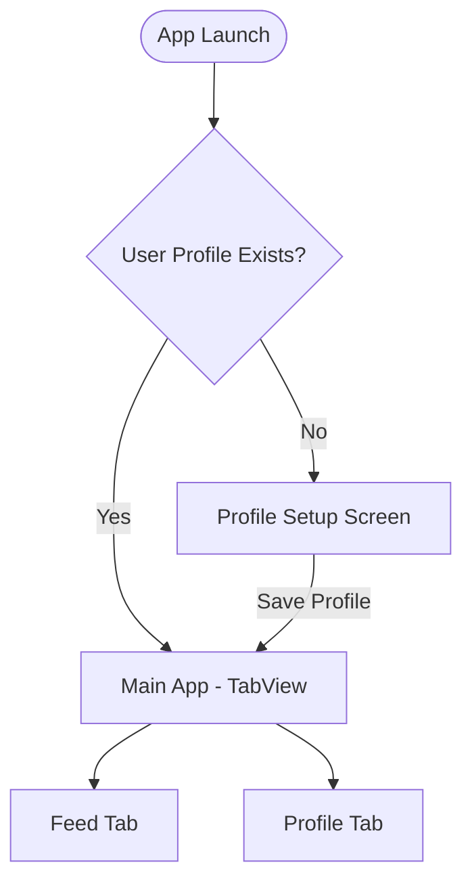

### Main User Flows

#### Flow 1: Browse and Buy Items

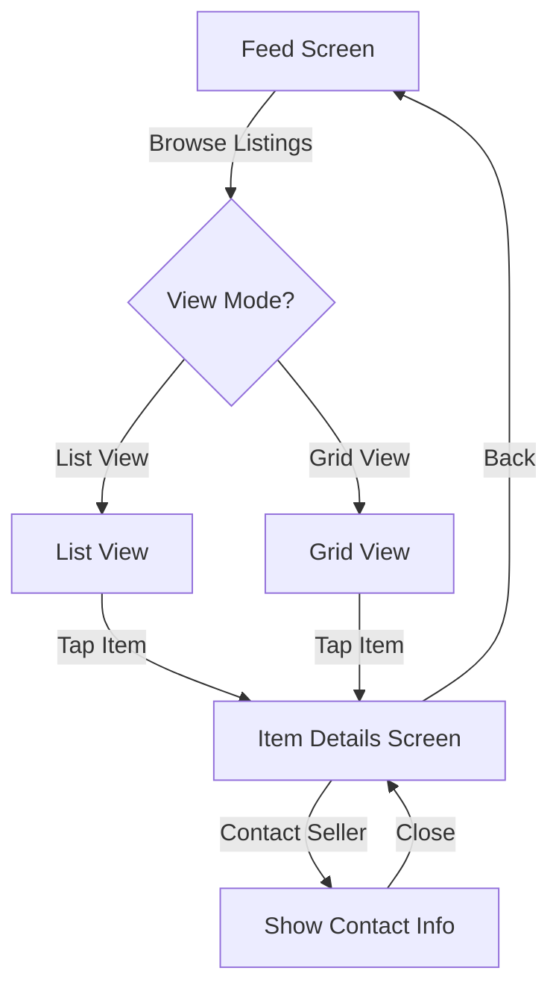

#### Flow 2: Create and Sell Items

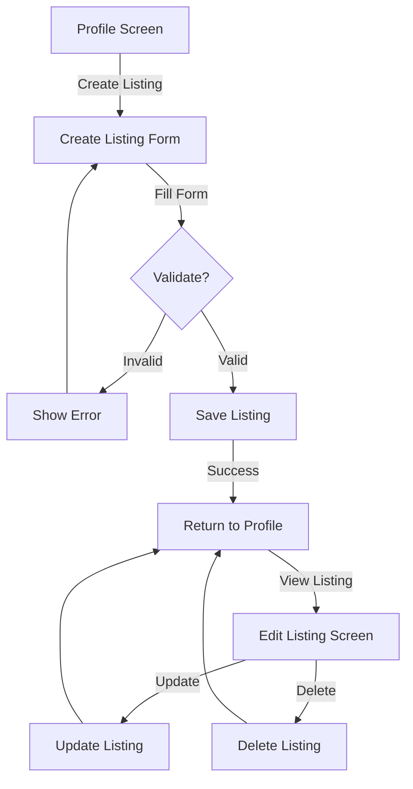

#### Flow 3: Feature a Listing

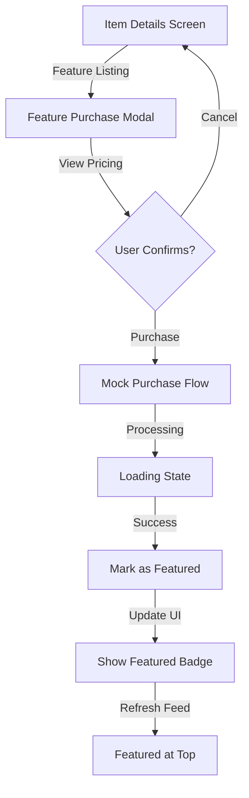

---

## Data Flow Diagrams

### Data Persistence Flow

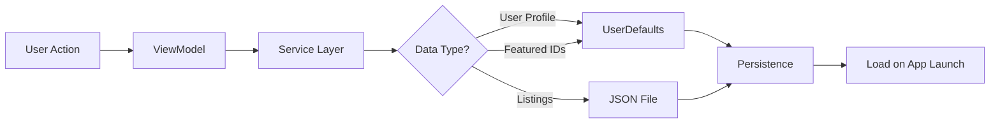

### Listing Data Flow

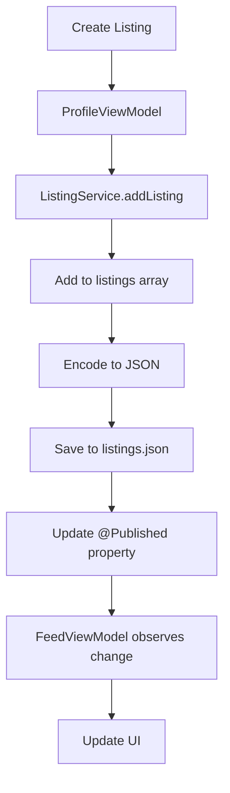

### User Profile Flow

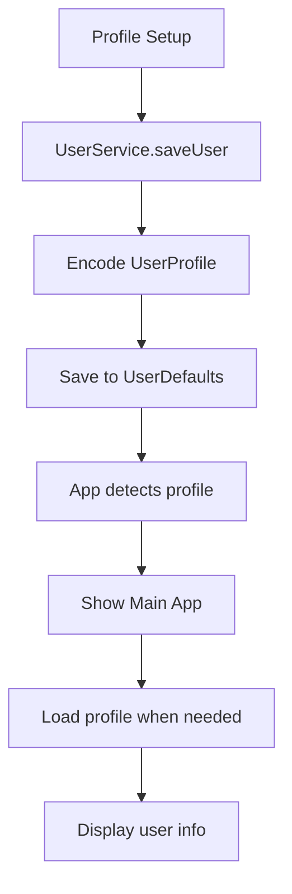

---

## Use Case Diagrams

### Primary Use Cases

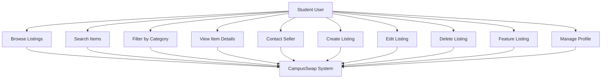

### Detailed Use Case: Create Listing

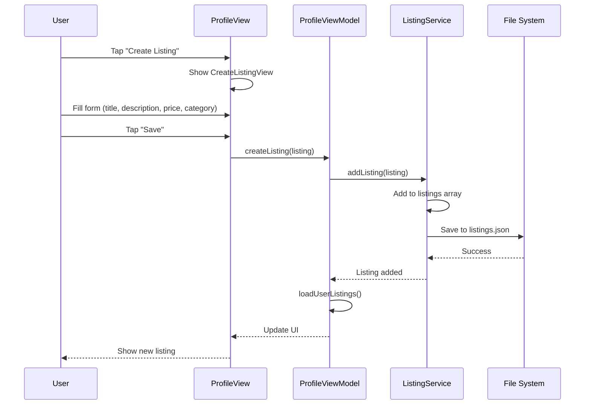

---

## Class Diagrams

### Core Models

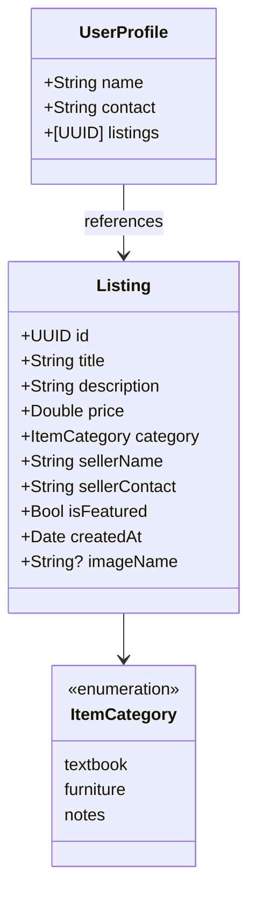

### Service Layer

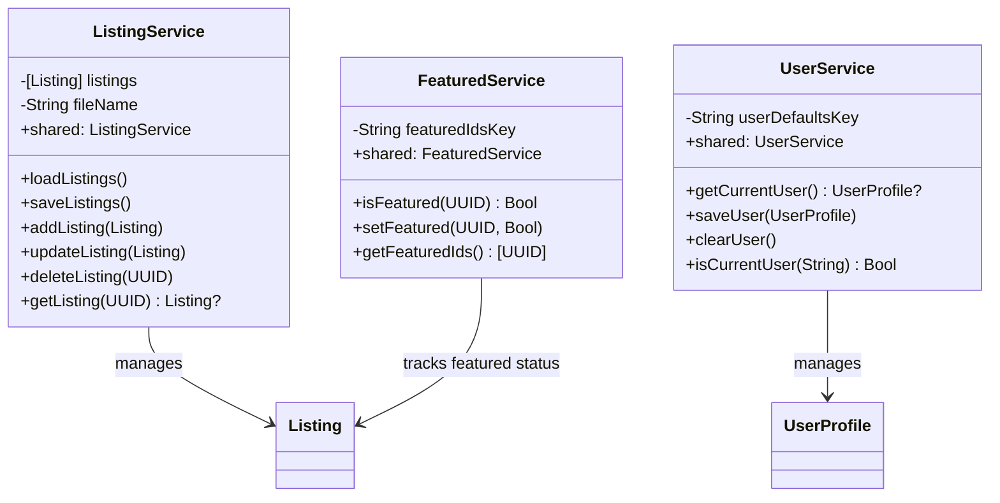

### ViewModel Layer

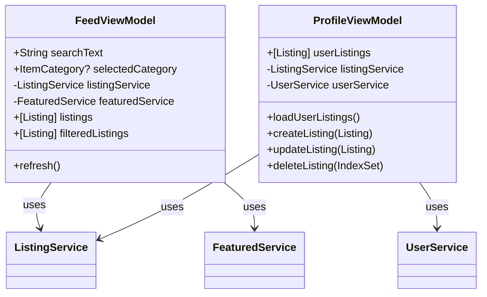

### View Layer

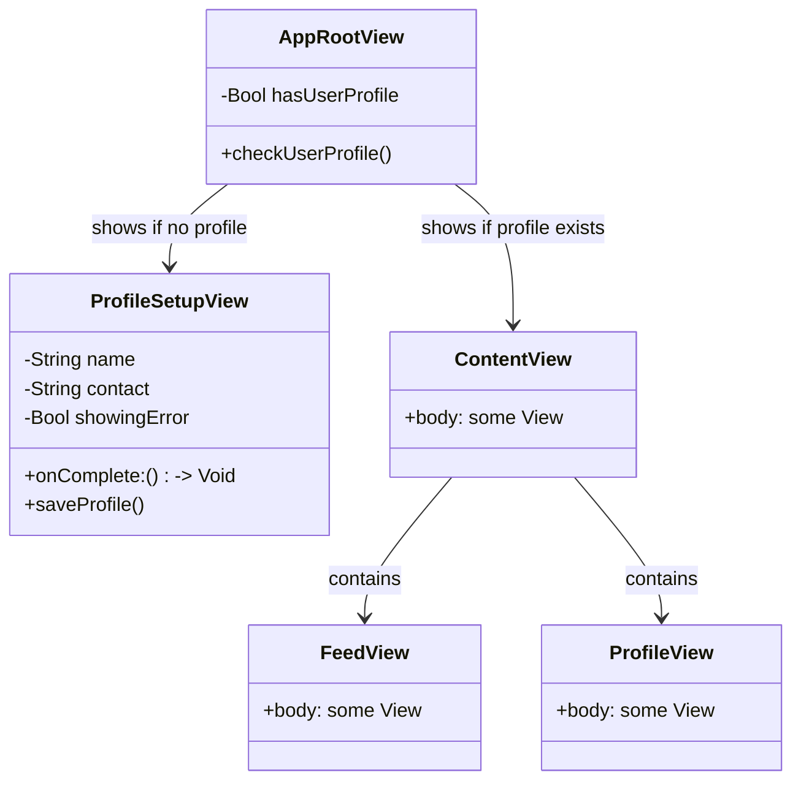

---

## Data Architecture

### Data Storage Strategy

#### UserDefaults
- **User Profile**: Current user's name, contact, and listing IDs
- **Featured Listing IDs**: Array of UUIDs for featured listings
- **Key**: `currentUser` (UserProfile JSON)
- **Key**: `featuredListingIds` ([UUID] JSON)

#### JSON File (listings.json)
- **Location**: App's Documents directory
- **Format**: JSON array of Listing objects
- **Encoding**: ISO8601 date format
- **Structure**:
```json
[
  {
    "id": "uuid",
    "title": "string",
    "description": "string",
    "price": 0.0,
    "category": "Textbook|Furniture|Notes",
    "sellerName": "string",
    "sellerContact": "string",
    "isFeatured": false,
    "createdAt": "2025-01-14T10:00:00Z",
    "imageName": "string?"
  }
]
```

### Data Model Relationships

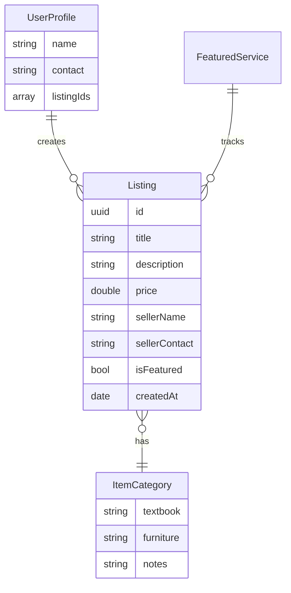

---

## Component Architecture

### View Components Hierarchy

```
AppRootView
├── ProfileSetupView (if no profile)
└── ContentView (if profile exists)
    ├── TabView
    │   ├── FeedView
    │   │   ├── SearchBar
    │   │   ├── ListView / GridView
    │   │   └── ListingRow / ListingCard
    │   └── ProfileView
    │       ├── User Info
    │       └── Listings List
    └── NavigationStack
        └── ItemDetailView
            ├── Item Info
            ├── Contact Button
            └── Feature Button
```

### Service Layer Architecture

```
Services (Singleton Pattern)
├── ListingService
│   ├── CRUD Operations
│   ├── JSON Persistence
│   └── @Published listings
├── UserService
│   ├── Profile Management
│   └── UserDefaults Persistence
└── FeaturedService
    ├── Featured Status Tracking
    └── UserDefaults Persistence
```

---

## Navigation Architecture

### Navigation Flow

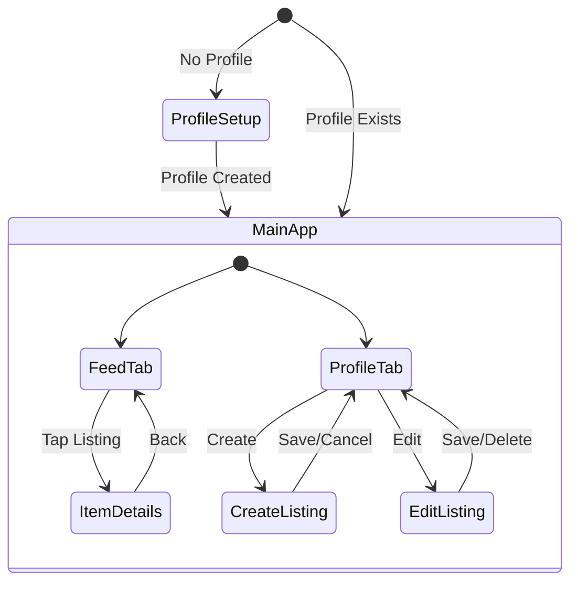

### Navigation Implementation

- **Tab Navigation**: `TabView` for main app sections
- **Stack Navigation**: `NavigationStack` for detail views
- **Modal Presentation**: `.sheet()` for forms and modals
- **Deep Linking**: Future enhancement for direct item links

---

## State Management

### Observable Pattern

```mermaid
flowchart TD
    A[@Published Property] --> B[View Observes]
    B --> C{Property Changes}
    C --> D[View Updates Automatically]
    
    E[User Action] --> F[ViewModel Method]
    F --> G[Update @Published]
    G --> A
```

### State Flow Example

```
User taps "Create Listing"
  ↓
ProfileView detects tap
  ↓
Shows CreateListingView (modal)
  ↓
User fills form and saves
  ↓
ProfileViewModel.createListing()
  ↓
ListingService.addListing()
  ↓
@Published listings updates
  ↓
ProfileViewModel.loadUserListings()
  ↓
@Published userListings updates
  ↓
ProfileView UI refreshes automatically
```

---

## Technical Stack

### Frameworks & Technologies

- **Language**: Swift 5.9+
- **UI Framework**: SwiftUI
- **iOS Version**: iOS 16.0+
- **Data Persistence**: 
  - UserDefaults (key-value storage)
  - FileManager (JSON file storage)
- **Architecture**: MVVM (Model-View-ViewModel)
- **State Management**: Combine framework (@Published, ObservableObject)
- **No External Dependencies**: Pure Apple frameworks only

### Design Patterns

1. **Singleton Pattern**: Services (ListingService, UserService, FeaturedService)
2. **Observer Pattern**: ViewModels observe Services via Combine
3. **Repository Pattern**: Services abstract data access
4. **MVVM Pattern**: Separation of concerns

---

## File Structure

### Current Implementation

```
CampusSwap/CampusSwap/
├── CampusSwapApp.swift          App entry point (AppRootView, WelcomeView integration)
├── Models/
│   ├── Listing.swift            Listing data model
│   ├── UserProfile.swift        User data model
│   └── ItemCategory.swift       Category enumeration
├── Views/
│   ├── Authentication/
│   │   ├── WelcomeView.swift    Entry screen (Login/Signup)
│   │   └── LoginView.swift      Mock login screen
│   ├── ProfileSetupView.swift   First-time user setup
│   ├── ContentView.swift        Main tab container
│   ├── FeedView.swift           Browse listings & Search
│   ├── ProfileView.swift        User profile & My Listings
│   ├── ItemDetailView.swift     Item details & Contact
│   ├── CreateListingView.swift  Create listing form
│   ├── EditListingView.swift    Edit listing form
│   ├── FeatureListingView.swift Feature purchase modal
│   └── Components/              (Various UI components)
├── ViewModels/
│   ├── FeedViewModel.swift      Feed logic & Filtering
│   ├── ProfileViewModel.swift   Profile logic & CRUD
│   └── ItemDetailViewModel.swift Item detail logic
├── Services/
│   ├── ListingService.swift     Listing CRUD operations
│   ├── UserService.swift        User profile & Auth management
│   ├── FeaturedService.swift    Featured listing tracking
│   └── SampleData.swift         Sample data generator
├── Utilities/
│   └── Extensions.swift         Helper extensions
└── Assets.xcassets/
    └── Logo.imageset/           App logo

Legend: Implemented
```

---

## Security & Privacy

### Data Privacy

- **Local Storage Only**: All data stored locally on device
- **No Backend**: No data transmitted to external servers
- **User Control**: Users can delete their profile and listings
- **Contact Information**: Only shared when user contacts seller

### Future Enhancements

- University email verification
- Secure authentication
- Encrypted local storage
- Privacy settings

---

## Performance Considerations

### Optimization Strategies

1. **Lazy Loading**: `LazyVStack` and `LazyVGrid` for large lists
2. **Efficient Filtering**: Computed properties for search/filter
3. **Singleton Services**: Shared instances reduce memory overhead
4. **JSON Caching**: Load once, update incrementally

### Scalability

- Current design supports 1000+ listings efficiently
- JSON file size manageable for local storage
- Future: Consider Core Data for larger datasets

---

## Testing Strategy

### Unit Testing (Future)

- Service layer tests
- ViewModel logic tests
- Data model validation tests

### Integration Testing (Future)

- End-to-end user flows
- Data persistence tests
- Navigation flow tests

---

## Future Enhancements

### Technical Improvements

1. **Core Data**: For more complex data relationships
2. **Image Storage**: Local image caching and management
3. **Offline Support**: Enhanced offline capabilities
4. **Push Notifications**: For new listings and messages
5. **Backend Integration**: Cloud sync and multi-device support

### Feature Additions

1. **Messaging System**: In-app communication
2. **Favorites/Wishlist**: Save items for later
3. **Ratings & Reviews**: Seller feedback system
4. **Map Integration**: Meetup location suggestions
5. **University Verification**: Email-based verification

---

**Document Version**: 1.0  
**Last Updated**: January 2026  
**Team**: CampusSwap Development Group
